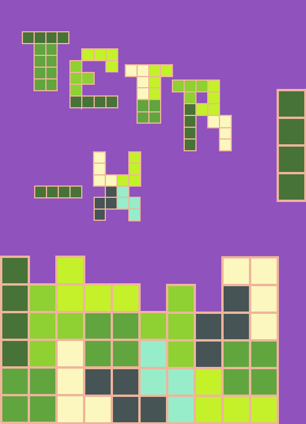
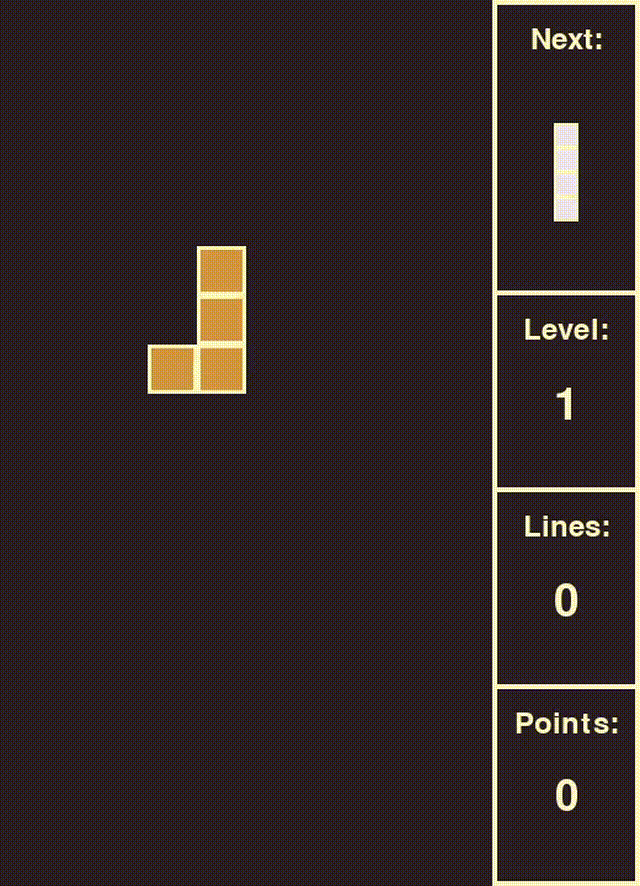
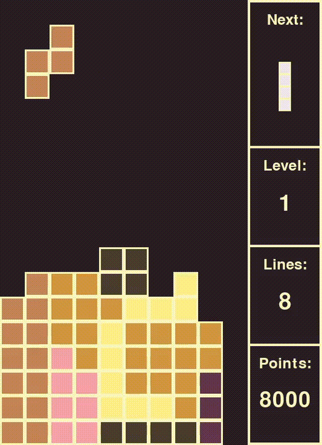
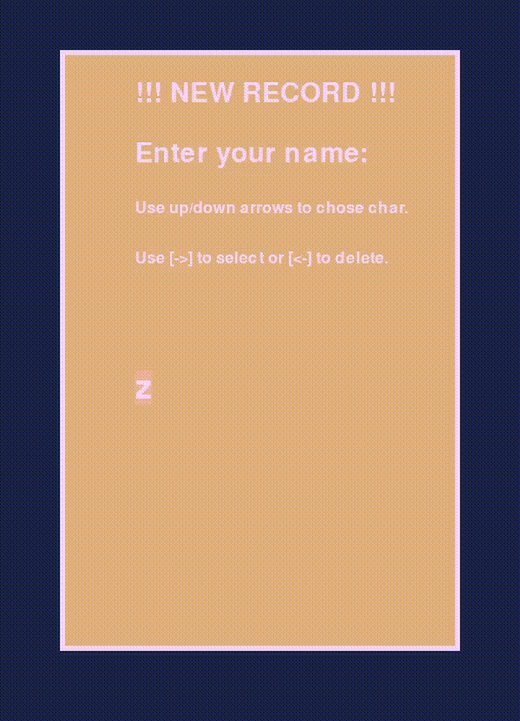

# Tetr_X (Python & Pygame)

## ⚠️ IMPORTANT LEGAL NOTICE
**Please read first:** [DISCLAIMER.md](./DISCLAIMER.md)

This repository contains code I wrote while practicing Python programming.
It serves as a demonstration of my self-taught skills in software development.

## Project Overview

This is my custom clone of the classic game "Tetris", built with Python 3 and the Pygame library.
As a personal challenge, I tried to solve coding problems with minimal external guidance. This approach led to some unconventional solutions (and a few inefficiencies), it turned into a good learning experience.

## What I Learned

- Object-Oriented Programming with modular class architecture
- Pygame game loop and event handling
- Keyboard and Mouse input processing
- File I/O (CSV) for high score persistence
- Collision detection algorithms
- Random number generation for gameplay mechanics
- Built a Screen to set the players name by chosing letters via Arrowkeys
- CX-Freeze for executable packaging

  
  

## How to Run

### Option 1: 📥 Download for Windows

A standalone Windows version has been created using **CX-Freeze**.
*Reference:* [CX-Freeze Documentation](https://cx-freeze.readthedocs.io)

**Windows Version v1.0.0:**
[🔽 Download tetr_x_win_v1.0.zip](https://github.com/pythonprojects2025/tetr_x/releases/tag/v1.0.0)

**THIS IS A LEARNING PROJECT** Please read the [DISCLAIMER](./DISCLAIMER.md) first before using this software! 

### Option 2: Running from Source (Linux)

If you wish to run the code directly on Linux via Terminal, follow these steps:

#### Update your system packages
    sudo apt update
    sudo apt upgrade

#### Navigate to the project folder
    cd path/to/project

#### Create a virtual environment
    python3 -m venv venv

#### Activate the virtual environment
    source venv/bin/activate

#### Install dependencies
    pip install -r requirements.txt

#### Run the application
    python tetr_x.py

**For detailed documentation, including screenshots, please refer to the German documentation in the docs folder.**

  
  

